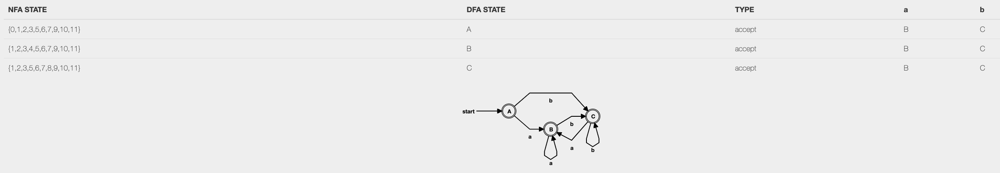
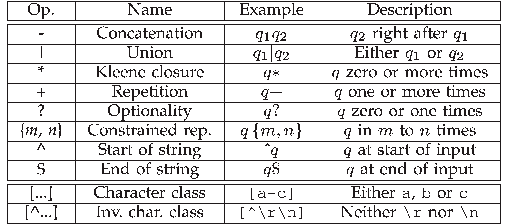

# Introduccion a las Expresiones regulares

| Tabla de contenido
| ------ |
| Introducción
| Tabla de simbolo
| Ventajas
| Desventajas
| Ejemplos
| Herramienta que puedes utilizar
| Conceptos basicos para entender expresiones regulares
| Conclusion
| Reto

## Introducción

### Expresión Regular (REGEX)

Las expresiones regulares te permiten definir condiciones breves y concisas, pueden ser utilizadas en muchos casos por ejemplo, desde la validación de una contraseña hasta buscar patrones de texto en documentos. Este lenguaje gráficamente podríamos verlo como un autómata, poniéndonos en contexto una regex evalúa una cadena de texto y evalúa si matchea con un patrón, por ejemplo un patrón muy común es
el de correo.

Ejemplo:

/(a*|b*)\*/

Si jamas han visto una expresión regular puede que parezca extraño pero espero al final de ese documento
esto sera un poco más fácil de leer

También hay que mencionar que hay un lenguaje estándar para poder realizar expresiones regulares y son
Soportados por lenguajes muy mainstream como JavaScript, C++, Pyhton, C# entre otros.

Las expresiones regulares tienen un beneficio de tener soporte de los estándares internaciones de software como ECMASCRIPT

## Tabla de simbolos

Hay un estandar de los simbolos que se utilizan para las expresiones regulares.

Hay que dejar algo claro las regex tienen sus ventajas y desventajas, pero definitivamente si aprendes a utilizar y entiendes su poder puede salvarte de muchas cosas , por ese motivo mencionare algunas ventajas y desventajas que e sentido en ellas.

## Ventajas

    - Buscar en un Documento una palabra especifica
    - Nos ayuda a validar entrada de datos de una forma sencilla
    - A nivel de codigo nos permite hacer rapidas validaciones dejando un poco los IF and ELSE
    - Una linea de Regex podria remplazar 100 lienas de codigo
    - Alguien aun no siendo programador, podria crear una expresion regular ( solo bastaria con e)

### Desventaja

    - Cuesta entender expresiones regulares, sobre todo al principio.
    - Dificil de debugear

## Ejemplos

Para testear cada uno de los patrones puedes entrar a la página:

    Comprobando si  es un username

> Patron: `^[a-z0-9_-]{3,16}$/`
>
> ## Descripcion
>
> Estamos diciendo que aceptamos letras minúsculas (a-z), números del 0 a 9,un guion bajo o guion. Seguido de esto indicamos con {3,16} que al menos sean escritos 3 caracteres y no más de 16.
>
> ## String que funcionaria
>
> `my-us3r_n4m3`
>
> ## String que no funcionaria
>
> `th1s1s-wayt00_l0ngt0beausername`

    Comprobando si es un hexadecimal

> Patron: `^#?([a-f0-9]{6}|[a-f0-9]{3})$/`
>
> ## Descripción
>
> Primero le decimos que # puede ser opcional utilizando el ? , seguido de desto aceptamos letas de (a-f) y numeros de (0-9) al menos {3} o (|) {6} caracteres
>
> ## String que funcionaria
>
> `#a3c113`
>
> ## String que no funcionaria
>
> `#4d82h4` (contains the letter h)

        Comprobando Emails

> Patron:`/^([a-z0-9_\.-]+)@([\da-z\.-]+)\.([a-z\.]{2,6})$/`
>
> Dentro del primero grupo hacemos match con 1 o más letras en minúscula, guion bajo , puntos y guiones. un "escaped dot" (./) significa que podría venir cualquier caracter. Directamente después de eso esperamos un '@' seguido esperaríamos el nombre del domain en cual podría contener al menos una letra, numero o undescore ( no tiene un límite), esperando luego un .Yy por último la extensión que puede ser de {2} a {6}.
>
> ## String que funcionaria
>
> john@doe.com
>
> ## String que no funcionaria
>
> #4d82h4 (contains the letter h)

## Herramientas que podrian hacer utiles

    - Pueden testear sus regex en esta página, muy intuitiva https://regex101.com/
    - Pueden colocar sus regex y ver el autómata que están crean muy útil si quieren empezar a entender los autómatas y regex :)
      https://cyberzhg.github.io/toolbox/nfa2dfa
    - Otra alternativa para poder testear las regex https://www.regextester.com/

## Conceptos que te podrian interesar para poder aprender Regex

    - Automatas
    - Maquina de Turin
    - Grafos
